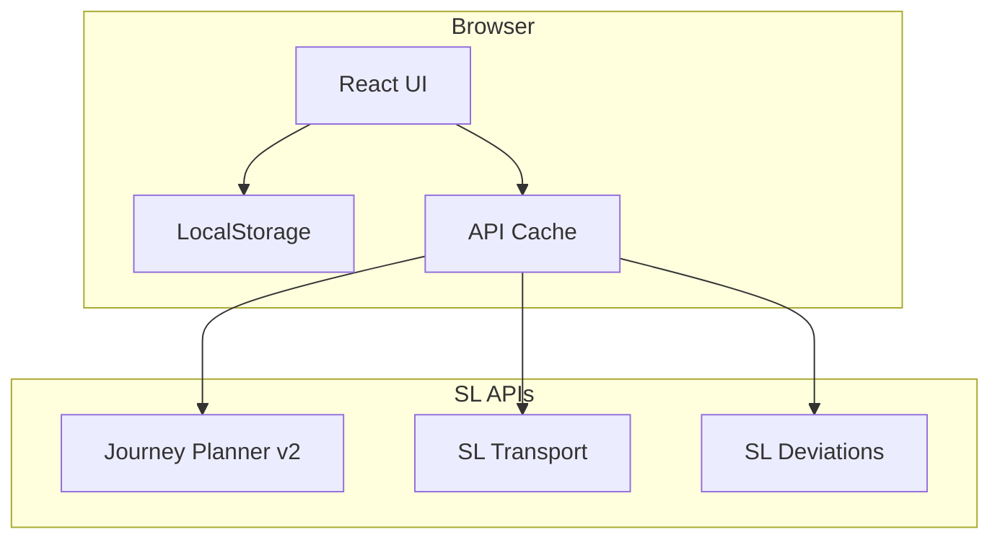

# SL Commute Dashboard MVP

## Architecture Overview



Static SPA with direct API calls, localStorage for config, and in-memory caching. No backend required for MVP.---

## Project Structure

```javascript
sl-departure-board/
├── src/
│   ├── api/
│   │   ├── journeyPlanner.ts    # Trip planning API
│   │   ├── transport.ts          # Departures API
│   │   ├── deviations.ts         # Disruptions API
│   │   └── cache.ts              # Simple time-based cache
│   ├── components/
│   │   ├── Dashboard.tsx         # Main dashboard view
│   │   ├── CommuteCard.tsx       # Single commute display
│   │   ├── TripProposal.tsx      # Trip with leave time
│   │   ├── DepartureBoard.tsx    # Mini departure list
│   │   ├── DeviationBanner.tsx   # Disruption warning
│   │   └── Setup/                # Configuration UI
│   ├── hooks/
│   │   ├── useCommutes.ts        # Commute data + refresh
│   │   ├── useDepartures.ts      # Departure polling
│   │   └── useConfig.ts          # LocalStorage persistence
│   ├── lib/
│   │   ├── leaveNow.ts           # Core timing logic
│   │   └── timeUtils.ts          # Time formatting helpers
│   ├── types/
│   │   └── index.ts              # Place, Commute, Trip types
│   ├── store/
│   │   └── config.ts             # LocalStorage read/write
│   ├── App.tsx
│   └── main.tsx
├── index.html
├── tailwind.config.js
├── vite.config.ts
├── tsconfig.json
└── package.json
```

---

## Phase 1: Project Initialization

1. Initialize Vite + React + TypeScript project
2. Install and configure Tailwind CSS
3. Set up CSS variables for e-ink-friendly theming (high contrast, no color-only signals)
4. Create base layout with dark/light mode toggle

---

## Phase 2: Type Definitions

Core types in `src/types/index.ts`:

```typescript
interface Place {
  id: string;
  label: string;
  coord: { lat: number; lon: number };
  journeyPlannerLocationId: string;
  transportSiteId?: string;
  prepSeconds: number;
}

interface Commute {
  id: string;
  label: string;
  originPlaceId: string;
  destinationPlaceId: string;
  modes: { bus: boolean; metro: boolean; train: boolean; tram: boolean };
  bufferSeconds: number;
  maxTrips: number;
}

interface TripProposal {
  departureTime: Date;
  arrivalTime: Date;
  durationMinutes: number;
  walkToFirstLegSeconds: number;
  legs: TripLeg[];
  routeSummary: string;
}

type LeaveStatus = "comfortable" | "tight" | "missed";
```

---

## Phase 3: API Layer

Three isolated API modules following your examples:| Module | Endpoint | Cache TTL |

|--------|----------|-----------|

| `journeyPlanner.ts` | `/v2/trips`, `/v2/stop-finder` | 60s per origin-dest pair |

| `transport.ts` | `/v1/sites/{id}/departures` | 30s per site |

| `deviations.ts` | `/v1/messages?site={id}` | 60s minimum |Each module returns normalized TypeScript types. The cache layer uses a simple Map with timestamps.---

## Phase 4: Core Leave-Now Logic

`src/lib/leaveNow.ts` - The heart of the product:

```typescript
function calculateLeaveStatus(
  trip: TripProposal,
  place: Place,
  commute: Commute,
  now: Date
): { status: LeaveStatus; latestLeaveTime: Date; slackSeconds: number }
```

Logic:

1. Find first non-walk leg departure time
2. Subtract: walkToFirstLegSeconds + prepSeconds + bufferSeconds
3. Calculate slack = latestLeaveTime - now
4. Classify: slack >= 180s = comfortable, 0-180s = tight, <0 = missed

---

## Phase 5: UI Components

### Dashboard (main view)

- Grid of CommuteCards (2-4 commutes)
- Last updated timestamp in corner
- Optional kiosk mode via `?kiosk=1` query param (hides setup button)

### CommuteCard

- Route label (e.g., "Home to Work")
- 1-3 TripProposal rows with:
- "Leave by HH:MM" or "Leave now!"
- Arrival time
- Slack indicator (text, not color-only)
- Visual status: green checkmark / yellow warning / red X with text labels

### Setup Page

- Manage Places (add/edit/delete)
- Manage Commutes
- JSON export/import for backup
- Refresh interval setting

---

## Phase 6: Storage Layer

`src/store/config.ts`:

- `loadConfig(): AppConfig`
- `saveConfig(config: AppConfig): void`
- `exportConfigJSON(): string`
- `importConfigJSON(json: string): AppConfig`

All stored in `localStorage` under key `sl-commute-config`.---

## Phase 7: Refresh Strategy

- Main data refresh: every 120 seconds (configurable)
- UI countdown tick: every 10 seconds (recalculates leave times from cached data)
- Deviations: max once per 60 seconds
- On window focus: immediate refresh if stale > 60s

---

## Phase 8: Error Handling

- Always display last successful data
- Show "Data from X min ago" if refresh fails
- Independent fallbacks:
- If Journey Planner fails, show departures only
- If departures fail, show planned trips only
- Console logging for debugging

---

## Phase 9: E-ink-Ready Styling

Tailwind config with CSS variables:

- `--text-primary`, `--bg-primary` for theming
- Large base font (18px minimum)
- No animations by default
- High contrast ratios (WCAG AAA)
- `/display` route with maximized content, no chrome

---

## Phase 10: Deployment

Static build output (`dist/`) ready for:

- Coolify with Nginx container
- Any static hosting (Vercel, Netlify, etc.)

Build command: `npm run build`---

## Key Files to Implement

1. **[src/types/index.ts](src/types/index.ts)** - All TypeScript interfaces
2. **[src/api/journeyPlanner.ts](src/api/journeyPlanner.ts)** - Trip fetching with stop-finder
3. **[src/api/transport.ts](src/api/transport.ts)** - Departure board data
4. **[src/lib/leaveNow.ts](src/lib/leaveNow.ts)** - Core timing calculations
5. **[src/components/Dashboard.tsx](src/components/Dashboard.tsx)** - Main view
6. **[src/components/CommuteCard.tsx](src/components/CommuteCard.tsx)** - Trip display with status